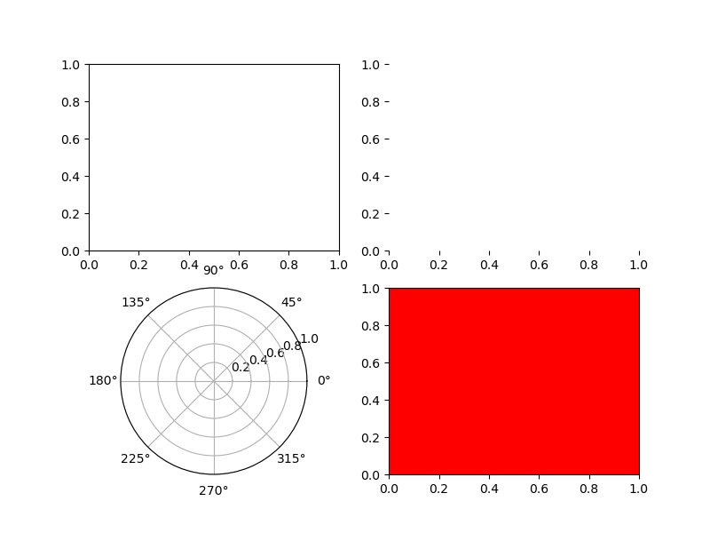
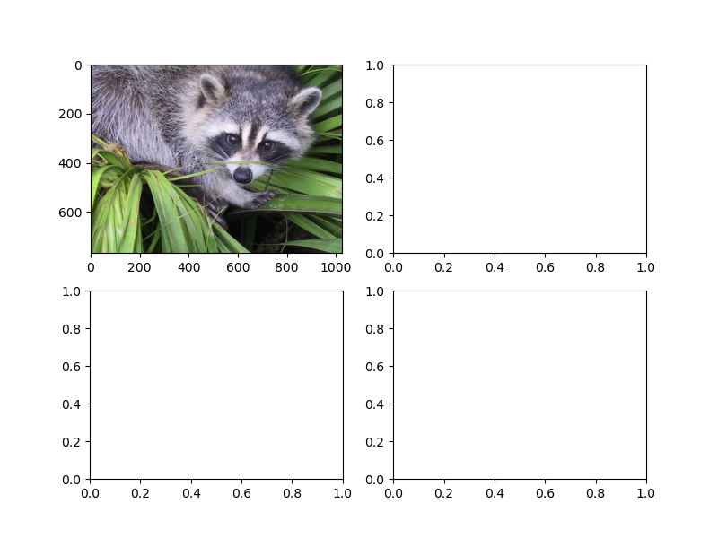
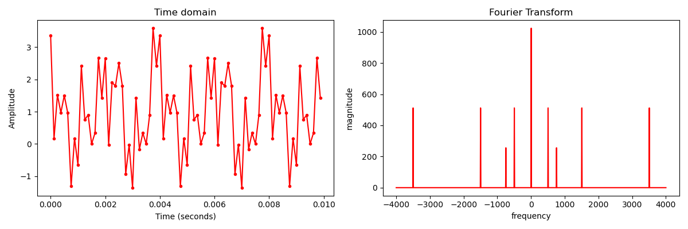
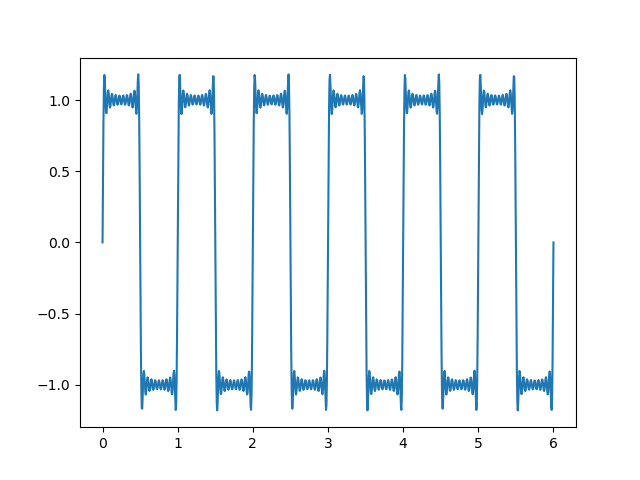
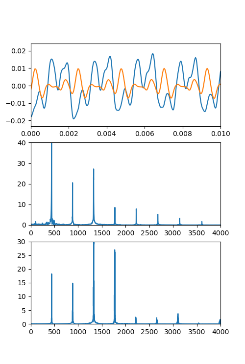

# Python_Plot_101
Some good examples for reference when plotting with numpy and matplotlib.pyplot. Outputs are listed.

### Include:
- **axe_subplot_example.py**  
Examples about how to use ax and subplot  

- **fft_ifft_example.py**  
Example about how to use `numpy.fft.fft()` and `numpy.fft.ifft()`

- **fourier_expand_example.py**  
Example about how to approximate fourier expansion  

- **misc.py**  
  -Broadcasting  
  -Import pictures  
  -Autocorrelation  
  -Convolve  
- **racoon_pic_grayscale.py**  
Example of get the grayscale of a colored picture.  
How to deal with pictures numerically
- **wav_file_fft_example.py**  
Example about how to analyse .wav files  

